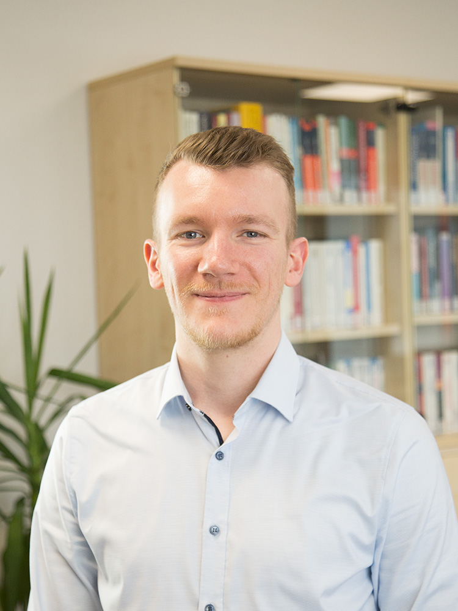

.. _about:

About
======

Ufil is the result of a dedicated and collaborative team effort. While led by Simon Schäfer, the framework has been shaped by the contributions of several researchers, developers, and student assistants. Each member of the team plays an important role in pushing the boundaries of infrastructure-based localization, combining their expertise to create a cutting-edge, robust, and versatile solution. This page provides a closer look at the individuals behind the framework and their specific contributions.

Maintainer
----------

**Simon Schäfer** is the maintainer and team lead of Ufil. With experience in perception and DevOps, Simon ensures the framework remains cutting-edge and accessible to users. His management and technical insights guide the ongoing development of Ufil, driving innovation and progress across the team.

**Contact Information:**  

- 📧 **Email**: `schaefer@embedded.rwth-aachen.de <mailto:schaefer@embedded.rwth-aachen.de>`_
- 🔗 **LinkedIn**: `Simon Schäfer <https://www.linkedin.com/in/simon-schaefer-abc123/>`_
- 🐙 **GitHub**: `Foxei <https://github.com/Foxei>`_

----

Team
----

.. list-table:: 
    :widths: 25 25 50
    :header-rows: 1

    *   - Name
        - Task
        - State
    *   - Massimo Macron
        - Simulation and Software Maturity
        - Active Student Assistant
    *   - Milo Priegnitz
        - Documentation and DevOps
        - Retired Student Assistant
    *   - Min Li
        - Driver Sensitive Surface Layer
        - Retired Student Assistant
    *   - Marius Molz
        - Central Fusion
        - Completed Master Thesis
    *   - Lucas Hegerath
        - Framework
        - Completed Master Thesis
    *   - Temur Fayzutdinov
        - Moving Horizon Estimators
        - Completed Master Thesis 
    *   - Hendrick Steidl
        - Tracking Sensitive Surface Layer
        - Completed Master Thesis
    *   - Nikolay Vuchkov
        - Occlusion Detection
        - Completed Bachelor Thesis 
    *   - Florian Eden
        - Central Fusion
        - Completed Bachelor Thesis 
    *   - Vicent Westhoff
        - Camera Object Detection
        - Completed Bachelor Thesis 
    *   - Malik Lesch
        - Privacy Compliant Dashcam
        - Completed Bachelor Thesis
    *   - Karl Kämmerling
        - Vehicle Motion Models
        - Completed Bachelor Thesis
    *   - Samantha Kamel
        - Soft GNSS
        - Completed Bachelor Thesis
    *   - Hadi Elnemr
        - Map Matching
        - Completed Bachelor Thesis

