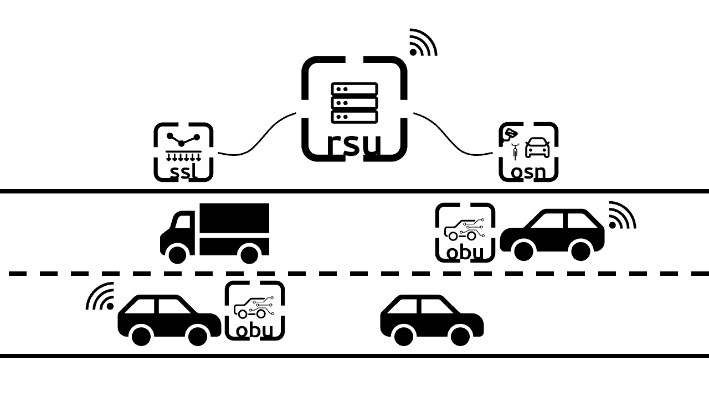
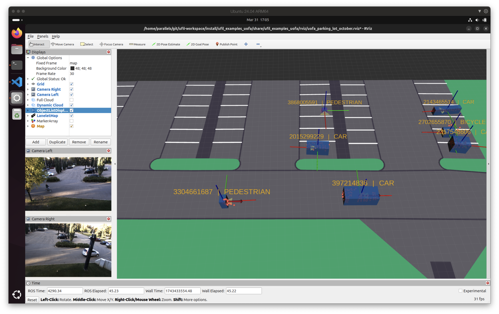

Concept
================

In Ufil, a module refers to a combination or collection of different components that work together to provide a higher-level functionality. A component, on the other hand, is an individual unit that provides a specific function, like visualization, filtering, or processing. A package is a collection of related components and modules that are grouped together for easier management.
   
   * **Components** are the building blocks, like separate packages that handle specific tasks (e.g., filtering, data visualization).
   * **Modules** are combinations of these components, designed to deliver more complex or complete functionality (e.g., a module for central fusion that integrates multiple components for data processing and fusion).
   * **Packages** are collections of related components and modules, organized for easier management.

This separation helps keep the architecture organized and modular, making it easier to mix and match components within different modules depending on the system requirements. 

Overview
--------

Ufil is a modular framework that enables the integration of location data from various sources. While the framework is extensible, it supports three distinct sources out of the box: Onboard Units (OBU), Outdoor Sensor Nodes (OSN), and Sensitive Surface Layers (SSL). These three sources transmit their data to a Roadside Unit (RSU) for fusion and integration into a single object list.

Each of the traffic participants is represented by a 3D bounding box with dynamic parameters. Ufil calls those bounding boxes *objects*. The object is defined by its center position, orientation, and dimensions (length, width, height). Each object is represented in a coordinate system, which can be either local or global. Local coordinate systems are the local systems of each data source or the local map. Global coordinate systems are usually the Universal Transverse Mercator (UTM), which is closest to the local map frame. An example of objects is shown in the image below:

Ufil is implemented in the ROS2 environment, but its fundamental object tracking library does not have any direct dependency on ROS2. Therefore, it can be used outside of ROS2. However, most of its supplementary communication components are implemented in ROS2 and require a functioning ROS2 installation. For more information on installing ROS2 and Ufil, please refer to the :ref:`installation <installation>` section.

Ufil Packages
-------------

Ufil provides four core packages: `ufil_core`, `ufil_obu`, `ufil_rsu`, and `ufil_osn`. Each package is designed for a specific area of the Ufil architecture and contains related components and modules.

* **ufil_core**:  
  This package includes the essential components and modules for Ufil's basic functionality. It provides:  

  - An object tracking framework  
  - Ufil-to-ROS2 conversions  
  - Visualization tools  
  - Communication bridges for interacting with non-ROS2 components  
  - Converters for transforming ROS2-based recordings into other file formats  

* **ufil_obu**:  
  Designed for the On-Board Unit (OBU) components, this package focuses on:  

  - Self-state estimation of vehicles  
  - Communication interfaces for Vehicle-to-Infrastructure (V2I) interactions  

* **ufil_osn**:  
  This package is tailored for the Outdoor Sensor Node (OSN) components. It includes:  

  - LiDAR and camera processing modules  
  - A tracker to detect and track traffic participants within the Field of View (FOV) of the sensor node  

* **ufil_rsu**:  
  Dedicated to the Road Side Unit (RSU) components, this package acts as the fusion center at the edge. It:  

  - Receives data from the OBU (via V2I) and OSN (via ROS2 interface)  
  - Processes the received data  
  - Provides a single global object list

* **ufil_ssl**:
  This package is designed for the Sensitive Surface Layer (SSL) components. It includes:  

  - This package is not yet converted over to C++. It will be converted in the future.

* **ufil_examples**:
  This package contains all the example applications built with Ufil so far. Each example has its own description in the :doc:`examples <../examples/examples>` section.

..  toctree::
    :caption: Contents:
    :maxdepth: 2

    framework/notation
    framework/object_definition
    updater/updater
    models/models
    hypothesize/hypothesize
    association/association