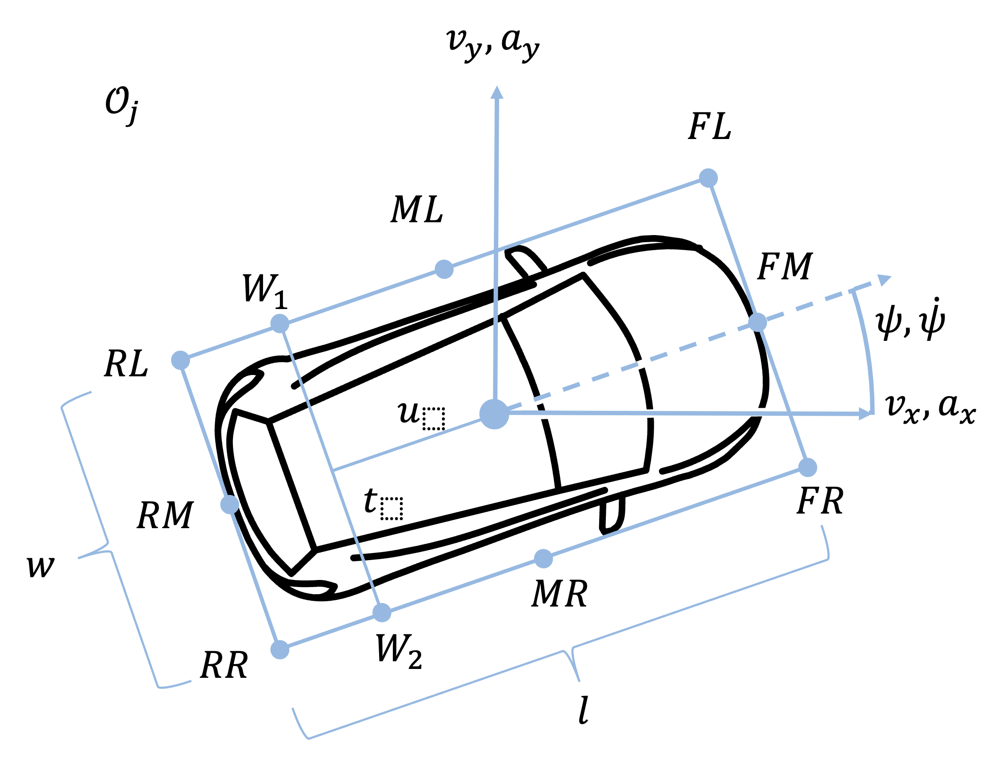

.. _object_definition:

Object Definition
=================

Ufil employs a simplified representation of 3D objects called a 2.5D object definition. This representation eliminates the z-component from position and orientation estimations, significantly reducing the state space. The object is depicted as a 3D bounding box, a rectangular prism that encompasses the object. The bounding box is defined by its center position, orientation, and dimensions (length, width, height). It encapsulates the object’s size, shape, and position. Since the z-position component is not estimated, the bounding box also assumes a zero roll and pitch. Ufil represents an object using a 2D pose with x, y, and yaw estimations. Estimations of 2D velocity and acceleration are possible but optional.

In addition to the 2D pose, Ufil introduces a 3D dimension, an existence probability, a feature vector, a classification vector, and an axis topology to the object definitions. Not all parts are used for all components of Ufil, but the ROS2 communication layer supports communications for all aspects of this object definition.

Ufil uses objects list to store and share objects. An object list is defined as:

.. math::
    \mathcal{O} = \{O_1, O_2,\dots, O_N\}

where :math:`N` is the number of objects in the list. 

Each object :math:`O` is defined as:

.. math::
    O = \{ \mathbf{x}, \mathbf{P_x}, \mathbf{d}, \mathbf{P_d}, p_e, \mathbf{c}, \mathcal{A}, \mathbf{f}\}

- :math:`\mathbf{x}` is the state vector of the object,
- :math:`\mathbf{P_x}` is the covariance matrix of the state vector,
- :math:`\mathbf{d}` is the dimension vector of the object,
- :math:`\mathbf{P_d}` is the covariance matrix of the dimension vector,
- :math:`p_e` is the existence probability of the object,
- :math:`\mathbf{c}` is the classification vector of the object (optional),
- :math:`\mathcal{A}` is the axis topology of the object (optional).
- :math:`\mathbf{f}` is the feature vector of the object (optional),

The **state** :math:`\mathbf{x}` of each object is representes as:

.. math::
    \mathbf{x} = \left[ p_x, p_y, v_x, v_y, a_x, a_y, \theta, \omega  \right]^T,

where:

- :math:`p_x, p_y` are the Cartesian coordinates of the vehicle,
- :math:`v_x, v_y` is the velocity (optional),
- :math:`a_x, a_y` is the acceleration (optional),
- :math:`\theta` is the heading angle (orientation) (optional),
- :math:`\omega` is the heading angle rate.

A possible **covariance** :math:`\mathbf{P_x}` of the state vector is represented as:

.. math::
    \mathbf{P_x} = \begin{bmatrix}
        \sigma_{p_x}^2 & 0 & 0 & 0 & 0 & 0 & 0 & 0 \\
        0 & \sigma_{p_y}^2 & 0 & 0 & 0 & 0 & 0 & 0 \\
        0 & 0 & \sigma_{v_x}^2 & 0 & 0 & 0 & 0 & 0 \\
        0 & 0 & 0 & \sigma_{v_y}^2 & 0 & 0 & 0 & 0 \\
        0 & 0 & 0 & 0 & -1 & 0 & 0 & 0 \\
        0 & 0 & 0 & 0 & 0 & -1 & 0 & 0 \\
        0 & 0 & 0 & 0 & 0 & 0 & \sigma_{\theta}^2 & 0\\
        0 & 0 & 0 & 0 & 0 & 0 & 0 &\sigma_{\omega}^2
    \end{bmatrix}

where :math:`\sigma` is the standard deviation of the corresponding component. The covariance matrix is a square matrix that describes the variance and covariance of the state vector. 
The diagonal elements represent the variance of each component, while the off-diagonal elements represent the covariance between different components. 
By definiton the covariance matrix is symmetric and positive semi-definite but in practive enforcing the matrix to be strictly positive definite is more desirable.
The example above shows has :math:`-1` for the acceleration components, which means that the acceleration is not estimated. The example also shows zeroes on the off-diagonal elements, which means that the components are not correlated. This is generally not the case for the true covariance matrix but estimation of cross-covariance is not easly archived.

.. note::
    Only optional parameters can be set to :math:`-1`. The other values in :math:`\mathbf{P_x}` must be positive or zero. The :math:`-1` value is used to indicate that the corresponding component is not estimated. This is useful for components that are not relevant for the specific application or when the estimation is not available. 

.. note::
    The :math:`\mathbf{P_x}` matrix must stay symmetric and positive definite. This means that the diagonal elements should be postive and not zero as zero values may lead to numerical instability. The diagonal elements should also be equal in both sides of the diagonal. The off-diagonal elements should be equal in both sides of the diagonal. 

The **dimension** :math:`\mathbf{d}` of the system is represented as:

.. math::
    \mathbf{d} = \left[ l, w, h \right]^T,

where:

- :math:`l` is the length of the vehicle,
- :math:`w` is the width,
- :math:`h` is the height (optional).

A possible **covariance** :math:`\mathbf{P_d}` of the dimension vector is represented as:

.. math::
    \mathbf{P_d} = \begin{bmatrix}
        \sigma_{l}^2 & 0 & 0 \\
        0 & \sigma_{w}^2 & 0 \\
        0 & 0 & -1
    \end{bmatrix}

where :math:`\sigma` is the standard deviation of the corresponding component. The covariance matrix is constructed analogously to the state vector covariance matrix. The diagonal elements represent the variance of each component, while the off-diagonal elements represent the covariance between different components. The same rules apply as for the state vector covariance matrix. 

The **existence probability** :math:`p_e` of the object is represented as:

.. math::
    p_e \in [0, 1]

where :math:`p_e` is the probability that the object exists. The value of :math:`p_e` is between 0 and 1, where 0 means that the object does not exist and 1 means that the object exists with certainty.

The **classification vector** :math:`\mathbf{c}` of the object is represented as:

.. math::
    \mathbf{c} = \left[ c_{car}, c_{truck}, c_{motorcycle}, c_{bicycle}, c_{pedestrian}, c_{stationary}, c_{other} \right]^T,

where:

- :math:`c_{car}` is the probability that the object is a car,
- :math:`c_{truck}` is the probability that the object is a truck,
- :math:`c_{motorcycle}` is the probability that the object is a motorcycle,
- :math:`c_{bicycle}` is the probability that the object is a bicycle,
- :math:`c_{pedestrian}` is the probability that the object is a pedestrian,
- :math:`c_{stationary}` is the probability that the object is stationary,
- :math:`c_{other}` is the probability that the object is of another type or unknown.

The classification vector is a vector of probabilities that the object belongs to a certain class. The sum of all elements in the classification vector should be equal to 1.

The axis topology :math:`\mathcal{A}` describes the spatial arrangement of the objects's tires. It is represented as:

.. math::
    \mathcal{A} = \{A_1, A_2,\dots, A_M\}

where :math:`M` is the number of axles in the list.

Each axle :math:`A` is defined as:

.. math::
    A = \{ t_w, \sigma^2_{t_w}, t_d, \sigma^2_{t_d}, \mathbf{b} \}

where:

- :math:`t_w` is the track width of the axle,
- :math:`\sigma^2_{t_w}` is the variance of the track width,
- :math:`t_d` is the distance between center of the axle and the center of the vehicle,
- :math:`\sigma^2_{t_d}` is the variance of the distance between center of the axle and the center of the vehicle,
- :math:`\mathbf{b}` is a boolean vector indicating the presence of a tire.

Both variance need to be positive. 

The tire presence vector :math:`\mathbf{b}` is defined as:

.. math::
    \mathbf{b} = \left[b_1, b_2, \ldots, b_M\right]^T

where:

- :math:`b_i` is a boolean value indicating the presence of the tire :math:`i` on axle. This one, two, or four elements depending on the axle configuration. The vector is ordered from left to right in driving direction.

.. warning::
    The feature vector is not yet fully implemented in ufil. The message definition exists and the basic structure is in place, but the actual feature extraction and processing components are still under development.

The feature vector :math:`\mathbf{f}` of the object is represented as:

.. math::
    \mathbf{f} = \left[ f_{FL}, f_{FR}, f_{RL}, f_{RR}, f_{L}, f_{R}, f_{F}, f_{B} f_{C}\right]^T,

where:

- :math:`f_{FL}` is the feature of the front left corner,
- :math:`f_{FR}` is the feature of the front right corner,
- :math:`f_{RL}` is the feature of the rear left corner,
- :math:`f_{RR}` is the feature of the rear right corner,
- :math:`f_{L}` is the feature of the left side,
- :math:`f_{R}` is the feature of the right side,
- :math:`f_{F}` is the feature of the front side,
- :math:`f_{B}` is the feature of the back side,
- :math:`f_{C}` is the feature of the center.

The feature vector is a boolean vector, where each element is either 0 or 1. A value of 1 indicates that the feature is available, while a value of 0 indicates that the feature is not available. For example, if a lidar sensor is used to track the object commonly an edge feature (L, R, F, B) or an corner feature (FL, FR, RL, RR) is available. If the object performs self state estimation, the feature vector including the center feature (C) is available. 