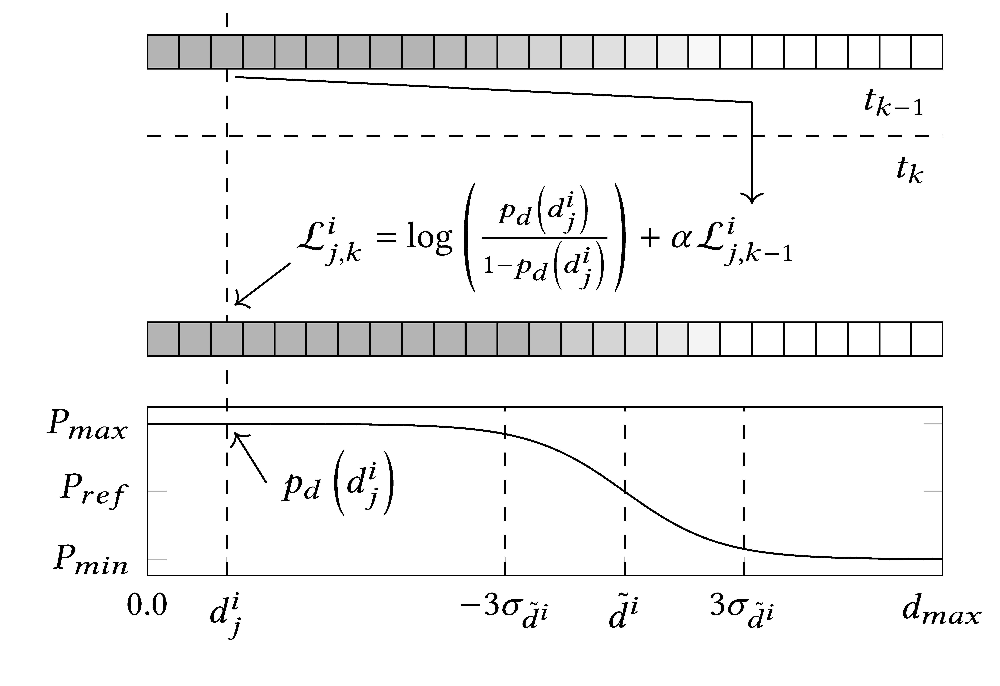

Dimension Fusion
================

The dimension fusion uses the algorithm described by Aeberhard but uses a different function for the size estimation.

Because the sizings in the perception of different sensors can vary greatly because of different field of views and angles, traditional methods shouldn't be used.

For every dimension length, width and height we use 1-dimensional gridmap that with a so called discretization and a different maximum size.
We estimate the dimension at time t based on the sensors measurements. The size of the gridmaps are based on the maximum size divided by the discretization.
Every Element of the map is independent of each other in the assumption. To calculate the probability that an element has been observed a binary bayes filter is used.
We calculate it like this:

.. math::
    p(m^d_i | \{d^{S_1 ... S_n}\}^t_0) = \frac{p(m^d_i | d^S) * p(d^S) * p(m^d_i | \{d^{S_1 ... S_n}\}^{t - 1}_0)}{p(m^d_i) * p(d^S | \{d^{S_1 ... S_n}\}^{t - 1}_0)}

Log-Odds-Form
-------------

Instead of directly calculating the probability we use the log odds ratio to prevent numerical instabilities
It is calculated as follows:

.. math::
    L^d_i(t) = log(\frac{p(m^d_i | d^S)}{1 - p(m^d_i | d^S)}) + L^d_i(t - 1) + log(\frac{prior}{1 - prior})

:math:`p(m^d_i | s)` is the current estimate of the sensor.
The prior is commonly chosen to be 0.5 and the variable for that in our implementation is P_ref.

To retrieve the probability from the log odds ratio it can be calculated as follows:

.. math::
    p(m^d_i | \{d^{S_1 ... S_n}\}^t_0) = 1 - \frac{1}{1 - e^{L^d_i(t)}}

Calculation of the probabilities
--------------------------------

The function we use to calculate the probabilities is the following one:

.. math::

    p_d = 
    \begin{cases}
        -2 * \frac{(P_{max} - P_{ref})} {1 + e^{\frac{d - x}{\sigma_{measured}}}} + P_{max}                      &\text{wenn } x < d \\
        prior                                                                                                &\text{wenn } x = d \\
        -2 * \frac{(P_{ref} - P_{min})} {1 + e^{\frac{d - x}{\sigma_{measured}}}} + 2 * P_{ref} - P_{min}        &\text{wenn } x > d \\
    \end{cases}

The illustration of the process can be found in the figure below.

   The figure shows the dimension fusion process. Time progresses from top to bottom. The first column shows the measurements from the last time step and the bottom curve shows the current measurement. The cell array in the middel is the updated dimension array.
   
Calculation of dimension and covariance
---------------------------------------

Now as we have the updated probabilities we will calculate the estimate and the variance for the dimensions.
For that we use these formulas:

.. math::
    d^G(t) = \sum x^d_i * p_i
    \sigma^2_{d^G} (t) = \sum (x^d_i - d^G)^2 * p_i.

For our threedimensional case we now have the values:

.. math::
    d^G(t) =
    \begin{cases}
        l^G(t) \\
        w^G(t) \\
        h^G(t) \\
    \end{cases}

    d_\sigma^2(t) = 
    \begin{cases}
        \sigma^2_{l^G} (t) \\
        \sigma^2_{w^G} (t) \\
        \sigma^2_{h^G} (t) \\
    \end{cases}

With that we are now finished.

Code Documentation
------------------

The code for the dimension fusion can be found in ``dimension_gridmap_updater.hpp`` and the required cell buffers are implemented in ``dimension.hpp``. The dimension fusion is implemented as a dimension updater and can be used in the same way as the other updater.

Example Usage
~~~~~~~~~~~~~~~

.. code:: cpp
    using State = ufil::type::state::PoseVelocity2D;                                                                                                         
    using Dimension = ufil::type::dimension::Dimension3D;
    using Measurement = ufil::type::measurement::Pose2DWithDimension3D;
    using Track = ufil::type::Track<State, Dimension, /*...*/>;                                                                                                
    using DimUpdater = ufil::update::dimension::DimensionGridmapUpdater<Track>;
    
    // Create updater and update dimension in loop                                                                                                           
    DimUpdater updater;                                                                                                                                        
    Dimension resulting_dimension;                                                                                                                           
    updater.update(track, measurement, timestamp, resulting_dimension);

References
--------------------------------

M\. Aeberhard, "Object-level fusion for surround environment perception in automated driving applications," VDI Verlag, 2017
