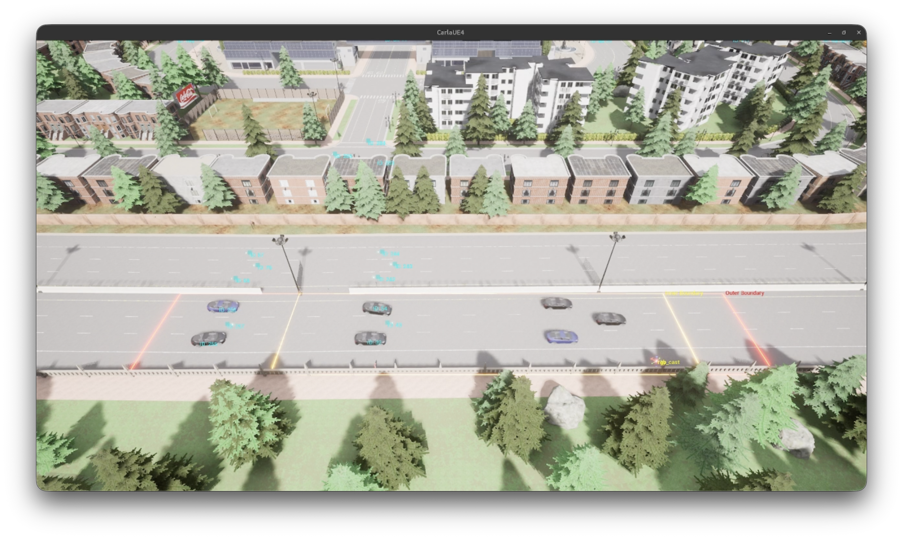

.. _examples_carla:

Carla
=====

This example demonstrates the use of Ufil in a simulated environment using the CARLA simulator. The CARLA simulator is an open-source autonomous driving simulator that provides a realistic environment for testing and developing autonomous driving algorithms. In this example, we will use Ufil to track traffic participants in the CARLA simulator and visualize the results.

The simulator is not designed for the use with ROS 2 out of the box therefore we use CARLOS [1] an extension of CARLA that provides a ROS 2 interface to the simulator. The CARLA simulator is used to generate synthetic sensor data, at an interseciton in `TOWN 10 <https://carla.readthedocs.io/en/latest/map_town10/>`_ or at a section of highway in `TOWN 5 <https://carla.readthedocs.io/en/latest/map_town05/>`_.

The example example illustrates the use of all Ufil's main components:

- The On-Board Unit (OBU) is simulated by a vehicle in the CARLA simulator. The `ufil_carla_adapter` package is used to convert the custom topic structure of the CARLA simulator to a Ufil object list. The `ufil_obu` package is used to send the object list in two different ways: One as a regular object list later used as ground truth and one as a Collective Awareness Message (CAM) which then can be used for the fusion by the RSU.
- The Outdoor Sensor Node (OSN) is simulated by a LiDAR sensor in the CARLA simulator. No adapter is required as the CARLA simulator already provides a ROS 2 interface for LiDAR data. The `ufil_osn` package is used to detect and track traffic participants within the Field of View (FOV) of the sensor node.
- The Sensitive Surface Layer (SSL) is simulated by a our custom CO-Simulation which used the ground truth data form the OBU to simulate the loads applyeid to the road surface by the traffic participants. The `ufil_ssl` package is used to process the simulated loads and detect and track the traffic participants based on the it.
- The Road Side Unit (RSU) is simulated by a fusion node that receives data from the OBU (via V2I), OSN (via ROS 2 interface) SSL (via ROS 2 interface) and processes the received data to provide a single global object list. The `ufil_rsu` package is used to implement the fusion node.

Getting Started
---------------

Start the full stack of the CARLA example by running the following command in a terminal:

.. code-block:: bash

    ros2 launch ufil_examples carla.launch.py

You should now see RViz similar to the one shown in the image below:

    Ufil visualization of the CARLA example.

Download the prerecorded bag files for the CARLA example from the following links: TOWN 10: https://drive.google.com/file/d/1n9s8l7Xo2mLh5e5z5z5z5z5z5z5z/view?usp=sharing, TOWN 5: https://drive.google.com/file/d/1n9s8l7Xo2mLh5e5z5z5z5z5z5z/view?usp=sharing. You can play the bag files using the following command:

.. code-block:: bash

    ros2 bag play <bag-file-name> --clock 500

You should now see the detected object lists in center and both cameras on the left side of the screen working. In order to see LiDAR pointcloud, navigate to the settings on the top left side of the screen and tick the box on **Full Cloud**.

The visualization should look like the one shown in the image below:

    Ufil visualization of the CARLA example.

[1] C. Geller et al., "CARLOS: An Open, Modular, and Scalable Simulation Framework for the Development and Testing of Software for C-ITS," IEEE Intelligent Vehicles Symposium (IV), Jeju Island, Republic of Korea, 2024, pp. 3100-3106, doi: 10.1109/IV55156.2024.10588502.
