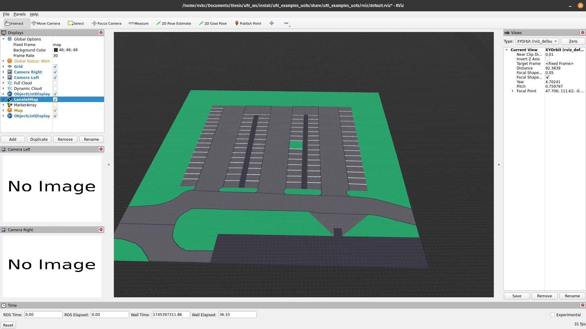
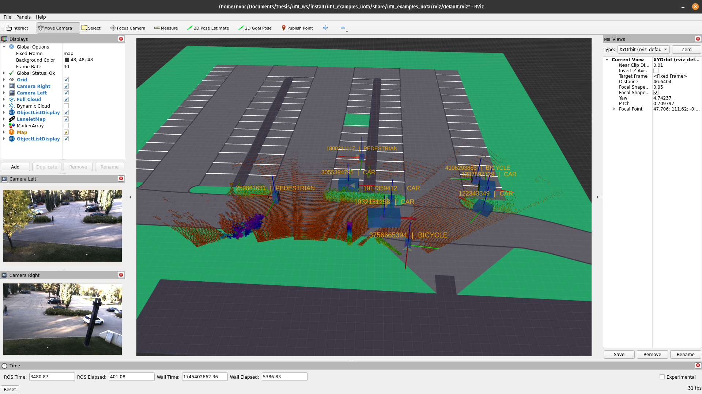
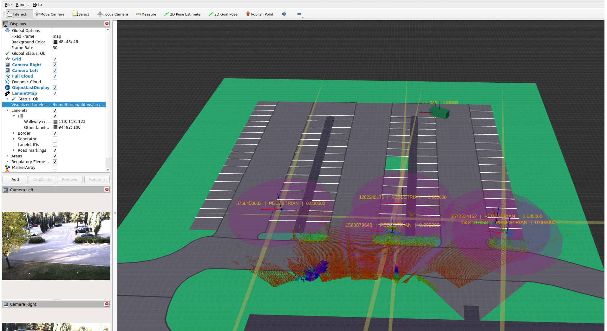
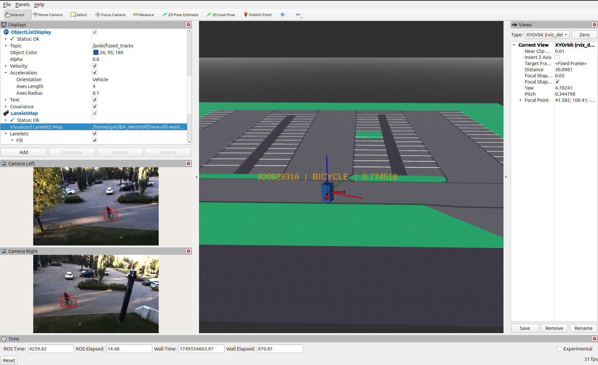

UofA
======

This section demonstrates a real-world deployment of the ufil framework at the University of Alberta (UofA) in Edmonton, Canada. The UofA campus features a parking lot equipped with an Outdoor Sensor Node (OSN) and the testing vehicle of the Node Lab led by Prof. Ehsan Hashemi. This example illustrates how a lidar and camera-based sensor node can be set up using ufil and how it can be utilized to transmit data from the vehicle via a V2I interface.

The example comprises three main components:

- The On-Board Unit (OBU) installed on the Node Lab testing vehicle. The Node Lab provides us with data gathered by the vehicle’s lidars and RTK GNSS system. The `ufil_uofa_adapter` package is employed to convert the vehicle data into a list of ufil objects. This list is subsequently transmitted via the V2I interface of the ufil_obu package to the RSU in the form of Cooperative Awareness Messages (CAMs).

- The Outdoor Sensor Node (OSN) is positioned at the roadside of the parking lot, approximately 6 meters above the ground. It utilizes a lidar and two cameras to detect objects in its environment. The lidar and a lightweight detection algorithm enable the OSN to determine the bounding box and state of the objects, while the cameras are used to classify them. The OSN employs the ufil_osn package for tracking purposes.

- The Roadside Unit (RSU) serves as a central hub, receiving CAMs from the OBU and object lists from the OSN. The RSU then fuses the object list from the OSN and the CAMs from the OBU into a single object list. For that it fuses the states, existence probability, classification and the dimensions. It applies a sensor-to-global fusion strategy. The RSU utilizes the `ufil_rsu` package.

Visualization
-------------
The visualization of the UofA example is done using RViz and is based on the plugins provided in the `ufil_core` package.   

Open a terminal and use the following command to launch the visualization:

.. code-block:: bash

    ros2 launch ufil_examples_uofa visualization.launch.py

At this point a RViz window should open. Inside you should be seeing an empty grid, different settings on the left and two camera windows below the settings.

Navigate to the settings at the left side of the screen and go to **LaneletMap**, click the three dots, and navigate to: ``<ufil-ws>/src/ufil-examples/uofa/ufil_examples_uofa/maps/UofA Parking Lot.osm``

After loading the map, it should look like this:

    Ufil visualization of the UofA campus parking lot.

Outdoor Sensor Node (OSN) 
-------------------------
This example provides a launch file that starts the pointclod preprocessor, the object detector and tracker, and all required transformation.
   
Open a terminal and use the following command to launch the OSN tracker:

.. code-block:: bash

    ros2 launch ufil_examples_uofa osn.launch.py

For the bag file continaing the sensor data open another terminal and navigate to the directory where you have stored your bag folder:

.. code-block:: bash

    cd ~/<bag-folder-holder>
    

.. attention::

    Make sure that you are in the directory with the folder of the bag file and not the directory with the .db3 and .yaml files!

Play the bag file(s):

.. code-block:: bash

    ros2 bag play <folder-name> --clock

You should now be see the detected object lists in center and both cameras on the left side of the screen working. In order to see liadr pointcloud, navigate to the settings on the top left side of the screen and tick the box on **Full Cloud**.
The visualization should look like this:

    Ufil visualization of the UofA campus parking lot and the OSN object detection.

On-Board Unit (OBU) 
-------------------
This example provides a launch file starte the adapter that changes the custom topic strucutre of the Node Lab testing vehicle to a ufil object list.
It sends its objects in two different ways: One as a regular object list and one as a Collective Awareness Message (CAM) which then can be used for the fusion by the RSU.
   
Open a terminal and use the following command to launch the OBU:

.. code-block:: bash

    ros2 launch ufil_examples_uofa obu.launch.py

For the bag file continaing the sensor data open another terminal and navigate to the directory where you have stored your bag folder:

.. code-block:: bash

    cd ~/<bag-folder-holder>
    

.. attention::

    Make sure that you are in the directory with the folder of the bag file and not the directory with the .db3 and .yaml files!

Play the bag file(s):

.. code-block:: bash

    ros2 bag play <folder-name> --clock

You should now be see the a single object in center and nothing else. The visualization should look like this:

.. figure:: ../../images/uofa_obu_only_example.png
    :width: 720px
    :align: center
    :alt: Ufil visualization with OBU only.

    Ufil visualization of the UofA campus parking lot and the OBU object.

Road-Side Unit (RSU) 
--------------------
The RSU provides the fusion of the object lists it receives from the OSN and the OBU. It receives a regular object list from the OSN and a Collective Awareness Message by the OBU which then gets converted into a regular object list.
First it transforms both lists into one coordinate system so that we can start with the fusion.
For that it fuses the state, the existence probability, the classification and the dimensions. 

Open a terminal and use the following command to launch the RSU:

.. code-block:: bash

    ros2 launch ufil_examples_uofa rsu.launch.py

Additionally the visualization, OBU and OSN should be started but only the nodes and not the bag files as we use our own bag files for the rsu that merged both OSN and OBU inputs.

.. code-block:: bash

    cd ~/<bag-folder-holder>
    

.. attention::

    Make sure that you are in the directory with the folder of the bag file and not the directory with the .db3 and .yaml files!

Play the bag file(s):

.. code-block:: bash

    ros2 bag play <folder-name> --clock

To make your life easier instead of starting the visualization, OBU, OSN and RSU alone you can use our launch file that starts all of them at once for you.

Open a terminal and use the following command to launch the whole system:

.. code-block:: bash

    ros2 launch ufil_examples_uofa uofa.launch.py

Default the values ``/pole/tracks/`` and ``/ufil/object-list/`` should be visible. To observe the fusion duplicate one of those, change the color and change the input to ``/rsu/fused_objects/``
Additionally if you want to see the received cam message you can add another one and change the topic to ``/rsu/obu/`` or swap it against the ``ufil/object-list/``

If everything is started and the inputs adapted the visualization should now look like this:

    Ufil visualization of the UofA campus parking lot and the OBU object.

Classifier Node
-------------------
This example provides a extended launch file that starts the OSN tracker as well as the Classifier Node. 
The Classifier Node refines the classifications of the tracker using the camera topics. 

Open a terminal and use the following command to launch the OSN tracker:

.. code-block:: bash

    ros2 launch ufil_examples_uofa osn_classifer.launch.py

For the bag file continaing the sensor data open another terminal and navigate to the directory where you have stored your bag folder:

.. code-block:: bash

    cd ~/<bag-folder-holder>
    

.. attention::

    Make sure that you are in the directory with the folder of the bag file and not the directory with the .db3 and .yaml files!

Play the bag file(s):

.. code-block:: bash

    ros2 bag play <folder-name> --clock

You should now see the detected object lists in center and both cameras on the left side of the screen working. 

To display the new track list published by the Classifier Node instead of the original track list by the tracker, expand the `ObjectListDisplay`` settings and klick on the topic filed. 
Change the topic from ``pole/tracks`` to ``pole/fused_tracks`` you should now see the fused track list. 

The Classification node also directly outputs annotated camera images, to display the annotated camera images go to the `Camera Right` settings and change the topic from ``camera_right/image_rect/compressed`` to ``annot_right/image_rect/compressed``. 
Do the exact same for the left camera aswell. 
The annotated images show the unfiltered classifications for each image and therefore do not have to be identical to the published track list.

The visualization should now look like this:

        
    Ufil visualization of the UofA campus parking lot, the OSN object detection, and the Classifier Node classification refinement.